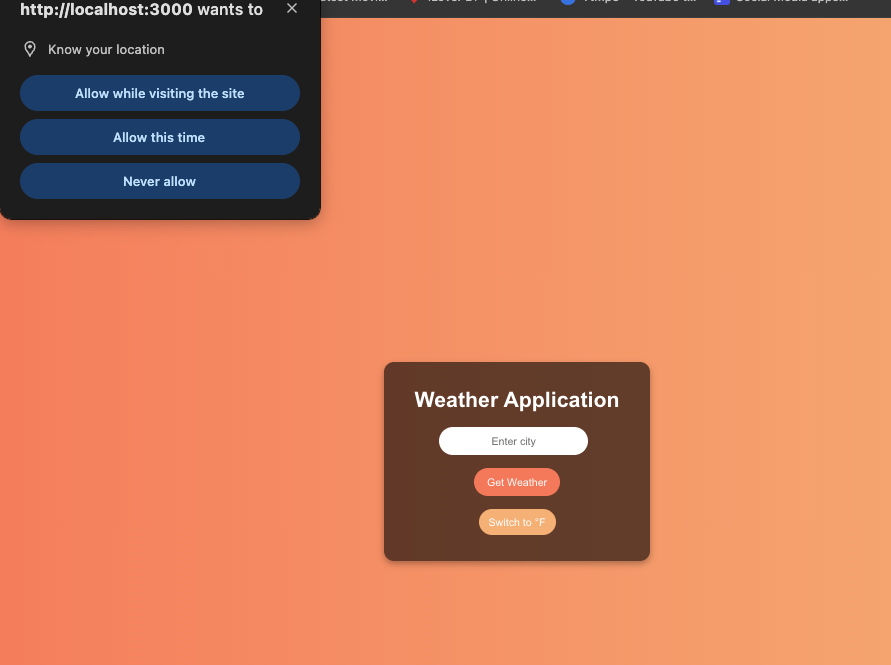

# React Weather Application

A simple weather application built with React.js that allows users to check the current weather and a 5-day forecast based on their location. The app fetches real-time weather data using the OpenWeather API.

## Features

- **Current Weather**: Displays the current temperature, humidity, wind speed, and weather conditions.
- **Weather Icons**: Display corresponding weather icons for each condition.
- **5-Day Forecast**: Provides a 5-day weather forecast with temperature and weather icons.
- **Geolocation**: Automatically fetch weather based on the user's location if the city is left empty.
- **Temperature Unit Toggle**: Switch between Celsius and Fahrenheit for temperature display.
- **Responsive Design**: Works well on desktop and mobile devices.

## Picture Demo

## Technologies Used

- **React.js**: JavaScript library for building user interfaces.
- **CSS**: For styling and layout.
- **OpenWeather API**: For fetching weather data.

### Prerequisites
Make sure you have **Node.js** and **npm** installed on your system. You can check this by running:
- node -v
- npm -v

## Installation
- Clone the repository:
    - git clone https://github.com/jnima2022/weather-application.git
    - cd weather-application

- Install dependencies:
    - npm install

- Start the application
    - npm start

- Visit the app in your browser or go to http://localhost:3000 in your browser to start using the app!

## Skills Shown

- **API Integration**: Successfully integrated the OpenWeather API to fetch real-time weather data.
- **State Management**: Managed and updated the app’s state to display dynamic weather data based on user input.
- **Event Handling**: Handled user interactions like button clicks and form submissions to fetch and display data.
- **Responsive Design**: Ensured the app is functional on both desktop and mobile devices.
- **Error Handling**: Implemented basic error handling for user input and API responses.
- **User Experience Design**: Focused on creating a user-friendly and visually appealing interface that enhances usability.

## Future Improvements

- **Dark Mode**: Implement a dark mode toggle for a better user experience during night-time use.
- **Hourly Forecast**: Show an hourly weather forecast to give users more detailed information.
- **Better Error Handling**: Improve error messages and add visual cues (e.g., loading spinners) for a smoother user experience.
- **Progressive Web App (PWA)**: Turn the app into a PWA for offline use and better performance.
- **Unit Conversion**: Add more unit conversion options (e.g., wind speed in mph/kph).
- **Weather Maps**: Display weather maps (e.g., radar or satellite imagery) for more detailed visual data.
- **User Preferences**: Allow users to save their preferred city for quick access.
